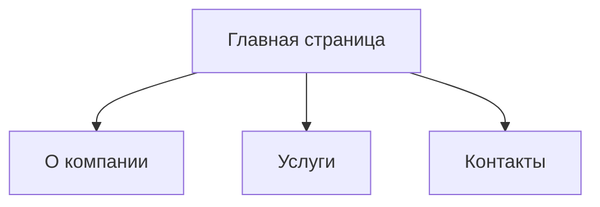

## 1. Обзор продукта
Корпоративный лендинг для международной логистической компании PLGLOBALLOJISTIK, предоставляющей услуги по транспортировке грузов по всему миру.

Создан для привлечения корпоративных и частных клиентов, демонстрации услуг и обеспечения удобной коммуникации с компанией. Цель сайта — повысить узнаваемость бренда и увеличить количество заявок на логистические услуги.

## 2. Основные функции

### 2.1 Роли пользователей
| Роль | Метод входа | Основные права |
|------|-------------|----------------|
| Посетитель сайта | Не требуется регистрация | Просмотр всех общедоступных страниц, отправка заявок |
| Администратор | Вход через админ-панель | Управление контентом, обработка заявок, просмотр аналитики |

### 2.2 Модули функций
Сайт состоит из следующих ключевых страниц:
1. **Главная страница**: Хедер с навигацией, герой-секция, услуги, о компании, преимущества, отзывы, контакты.
2. **О компании**: История, миссия, команда, сертификаты.
3. **Услуги**: Детальное описание всех видов логистических услуг.
4. **Контакты**: Форма обратной связи, карта офисов, контактная информация.

### 2.3 Детали страниц
| Название страницы | Модуль | Описание функций |
|--------------------|--------|------------------|
| Главная страница | Хедер с языковым переключателем | Отображение логотипа, главного меню, кнопки переключения языков (EN/TR), мобильного бургера |
| Главная страница | Герой-секция | Крупный баннер с изображением морских контейнеров, заголовком "Международная логистика для вашего бизнеса", подзаголовком и CTA-кнопкой "Получить консультацию" |
| Главная страница | Услуги | Карточки с основными услугами: морские перевозки, авиадоставка, железнодорожный транспорт, складская логистика, таможенное оформление |
| Главная страница | О компании | Краткая информация о годах на рынке, географии работы, объёмах перевезённых грузов с иконками для визуализации |
| Главная страница | Преимущества | Карточки с преимуществами компании: опыт, индивидуальный подход, надёжность, круглосуточная поддержка |
| Главная страница | Контактная форма | Форма для быстрой отправки заявки с полями: имя, email, телефон, сообщение |
| О компании | История компании | Хронология развития бизнеса с ключевыми вехами |
| О компании | Миссия и ценности | Описание принципов работы компании |
| О компании | Команда | Фотографии и должности ключевых специалистов |
| О компании | Сертификаты | Галерея с сертификатами и лицензиями |
| Услуги | Детальное описание услуг | Для каждого вида транспортировки: особенности, сроки, охват географии, преимущества для клиентов |
| Контакты | Контактная информация | Адреса офисов, телефоны, email, часы работы |
| Контакты | Интерактивная карта | Отображение расположения офисов на карте Google Maps |

## 3. Основные процессы
Пользователь переходит на главную страницу, может ознакомиться с услугами, перейти на страницу с детальным описанием услуг, узнать больше о компании на странице "О нас" или отправить заявку через форму на главной или странице контактов.

## 4. Дизайн пользовательского интерфейса
### 4.1 Стиль дизайна
- Основные цвета: Тёмно-синий #0B1F3A, акцентный синий #1565C0, светло-серый #777777, дополненные белым #FFFFFF и серым #F5F5F5 для фонов
- Кнопки: Закруглённые углы (border-radius 8px), градиентная заливка из основного синего в акцентный, эффект наведения с небольшим увеличением
- Шрифты: Основной — Inter, заголовки 24-48px, основной текст 16px, вспомогательный 14px
- Лейаут: Карточная система, фиксированный хедер, отступы между секциями 80px, адаптивная сетка 12 колонок
- Иконки: Линейные иконки из Material Icons, стилизованные под корпоративный стиль

### 4.2 Обзор дизайна страниц
| Название страницы | Модуль | Элементы интерфейса |
|--------------------|--------|---------------------|
| Главная страница | Хедер | Тёмно-синий фон #0B1F3A, белый текст для навигации, языковой переключатель в правом углу |
| Главная страница | Герой-секция | Фон с изображением грузовых кораблей в порту, полупрозрачный тёмный оверлей, белый текст по центру, CTA-кнопка с акцентным синим фоном |
| Главная страница | Секция услуг | Белый фон, карточки с серой подложкой #F5F5F5, ховер-эффект с подъёмом карточки (box-shadow), иконки с акцентным синим цветом |

### 4.3 Адаптивность
Desktop-first подход с полной адаптацией под мобильные устройства: мобильное меню-бургер, перестройка сетки на планшетах и смартфонах, оптимизированные отступы и размеры шрифтов.

### 4.4 Рекомендации по изображениям
- Геро-секция: Профессиональное фото морского порта с контейнерами и кранами
- Услуги: Каждой услуге соответствует тематическое фото: авиасудно, поезд, склад с погрузчиками
- О компании: Фото офиса, команды в рабочей обстановке
- Все изображения оптимизированы для веб, в формате WebP, с разрешением не ниже 1920px по ширине