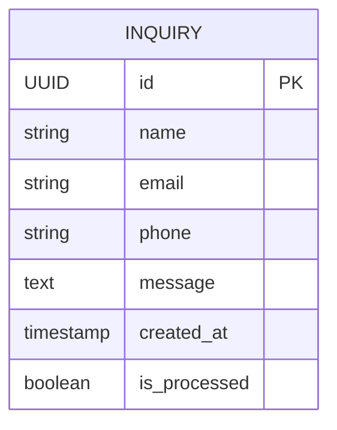

## 1. Архитектура приложения
```mermaid
graph TD
    A[Браузер пользователя] --> B[Next.js 16 Frontend]
    B --> C[next-intl (локализация)]
    B --> D[Supabase для хранения заявок]
    B --> E[Google Maps API]
    
    subgraph "Frontend Layer"
        B
        C
    end
    
    subgraph "Внешние сервисы"
        D
        E
    end
```

## 2. Описание технологий
- Frontend: Next.js 16 (App Router) + TypeScript + TailwindCSS 4
- Инструмент инициализации: npx create-next-app@latest
- Локализация: next-intl
- Карты: @react-google-maps/api
- Бэкенд: Supabase (для приёма и хранения заявок с форм)

## 3. Определение роутов
| Путь | Назначение |
|------|------------|
| /[locale] | Главная страница (локализация EN/TR) |
| /[locale]/about | Страница о компании |
| /[locale]/services | Страница с описанием услуг |
| /[locale]/contacts | Страница контактов с формой |

## 4. Определение API
### 4.1 Отправка заявки с контактной формы
```
POST /api/submit-inquiry
```
Запрос:
| Параметр | Тип | Обязательность | Описание |
|----------|-----|----------------|----------|
| name | string | true | Имя клиента |
| email | string | true | Электронная почта |
| phone | string | true | Телефон |
| message | string | false | Сообщение |

Ответ:
| Параметр | Тип | Описание |
|----------|-----|----------|
| success | boolean | Статус отправки |
| error | string | Текст ошибки (если есть) |

## 5. Модель данных
### 5.1 Определение модели


### 5.2 DDL для базы данных
```sql
CREATE TABLE inquiries (
    id UUID PRIMARY KEY DEFAULT gen_random_uuid(),
    name VARCHAR(255) NOT NULL,
    email VARCHAR(255) NOT NULL,
    phone VARCHAR(50) NOT NULL,
    message TEXT,
    created_at TIMESTAMP WITH TIME ZONE DEFAULT NOW(),
    is_processed BOOLEAN DEFAULT FALSE
);

-- Разрешения для Supabase
GRANT INSERT ON inquiries TO anon;
GRANT SELECT ON inquiries TO authenticated;
GRANT UPDATE ON inquiries TO authenticated;
```